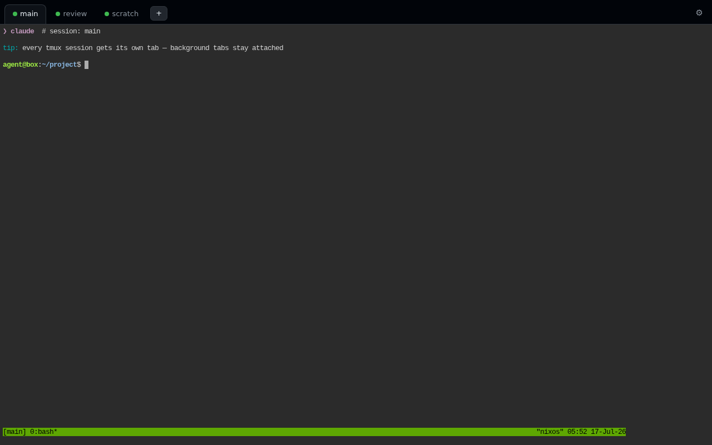

# agent-box

Reproducible, multi-user coding-agent sandboxes - one click on AWS or Azure, on
bare metal, or as a VM image, from one declarative config. (Built on Nix - as a
full NixOS system, or as a pinned Nix profile on an ordinary Linux distro.)

Each agent is an **unprivileged user** running a supported **harness** (the
agent CLI itself: `claude` or `codex`) inside a persistent `tmux` session. The only elevated power an agent gets is a tight,
explicit passwordless-`sudo` allowlist. Custom tokens (e.g. `GH_TOKEN`) are
injected via drop-in `EnvironmentFile`s that never enter the world-readable Nix
store.

Supported agents:

| Agent | Package | Autonomy flag used by `skipPermissions = true` | Notes |
| --- | --- | --- | --- |
| Claude Code | `pkgs.claude-code` | `--dangerously-skip-permissions` | Supports Claude Remote Control. |
| Codex | `pkgs.codex` | `--dangerously-bypass-approvals-and-sandbox` | Per session, *either* the TUI in the browser terminal *or* Remote Control via the `codex remote-control` daemon (`remoteControl = true`) - not both. |

## 1-click AWS launch

Provisions one AWS Lightsail instance with the agent, the browser terminal
(Caddy -> ttyd) and everything around them already wired up, priced as **one
flat monthly bundle** (compute + SSD + static IPv4 + a multi-TB transfer
allowance). Lightsail has no NixOS blueprint, so the box boots the stock
Ubuntu 24.04 blueprint and stays Ubuntu: Nix is installed as a plain package
manager and agent-box lands as a pinned Nix profile. Expect the first launch
to take a few minutes — installing Nix, substituting the profile, and Caddy
issuing a Let's Encrypt cert against `<static-ip>.sslip.io`. There is no
closure to build and no reboot.

| Region | Launch |
| --- | --- |
| us-east-1 (N. Virginia) | [Launch stack →](https://console.aws.amazon.com/cloudformation/home?region=us-east-1#/stacks/quickcreate?stackName=agent-box&templateURL=https%3A%2F%2Fdefang-agent-box.s3.us-west-2.amazonaws.com%2Flightsail-template.yaml) |
| us-west-2 (Oregon) | [Launch stack →](https://console.aws.amazon.com/cloudformation/home?region=us-west-2#/stacks/quickcreate?stackName=agent-box&templateURL=https%3A%2F%2Fdefang-agent-box.s3.us-west-2.amazonaws.com%2Flightsail-template.yaml) |
| eu-central-1 (Frankfurt) | [Launch stack →](https://console.aws.amazon.com/cloudformation/home?region=eu-central-1#/stacks/quickcreate?stackName=agent-box&templateURL=https%3A%2F%2Fdefang-agent-box.s3.us-west-2.amazonaws.com%2Flightsail-template.yaml) |
| eu-west-1 (Ireland) | [Launch stack →](https://console.aws.amazon.com/cloudformation/home?region=eu-west-1#/stacks/quickcreate?stackName=agent-box&templateURL=https%3A%2F%2Fdefang-agent-box.s3.us-west-2.amazonaws.com%2Flightsail-template.yaml) |

Choose `Agent` (`claude` or `codex`), set a `WebPassword` (any 16&ndash;64
characters, including password-manager symbols), pick a bundle size,
launch. The stack reports
CREATE_COMPLETE only after the box phones home from its first successful
apply — a first boot that goes wrong rolls the
stack back visibly instead of leaving a green stack with a dead URL. The agent runs as the
`UserName` linux user (default `agent`). Lightsail manages the networking, so
nothing on the account has to be pre-configured. The
stack Outputs show `https://<ip>.sslip.io/<UserName>/` - open it, sign in
as the `UserName` with your `WebPassword`, complete the selected agent's
one-time sign-in, done. `<UserName>-main@<host>.sslip.io` is used as the Claude
Remote Control session name - the box's public address, so the entry in the
Claude apps doubles as the address you reach it at.

**Cost.** The bundle price is the whole bill — no separate EBS, transfer, or
public-IPv4 line items. The default `small_3_0` (2 vCPU / 2 GiB / 60 GiB SSD)
is **$12/mo flat**; bundles range from that up to `xlarge_3_0` (16 GiB,
$84/mo). **2 GiB is the smallest offered**, here and on the EC2 template:
smaller bundles do boot, but a harness plus a language server plus a build
is what actually runs on this box, and they leave nothing for it. Pick
`medium_3_0` (4 GiB, $24/mo) for parallel sessions or heavy builds. The
attached static IPv4 is included, and the URL survives a stop/start (a live
tmux session doesn't; RAM is lost on any stop). Delete the stack to stop
billing.

Out of disk? Lightsail bundles have a fixed SSD — snapshot the instance and
restore onto a larger bundle to grow. The box also garbage-collects the nix
store automatically.

**Root shell for debugging.** The browser terminal is an unprivileged `agent`
user. For a root path onto the box (e.g. to read
`/var/log/agent-box-bootstrap.log` after a first boot that timed out), the
template leaves port 22 open by default (`DebugSsh`) for key-only SSH as
`ubuntu` with the Lightsail default key: download it from the Lightsail
console (Account -> SSH keys), then `ssh -i <key> ubuntu@<static-ip>` and
`sudo -i`. The box is ordinary Ubuntu, so the console's own browser SSH
works too. Password auth stays off; set `DebugSsh=false` at launch to keep
22 closed.

**Changing the web password.** Open the settings page (the gear icon next to
the terminal), choose **Change password**, and enter the current password plus
the new password twice. The new password follows the launch-time 16&ndash;64
character policy. Saving replaces the root-owned password hash using Caddy's
recommended Argon2id algorithm, reloads Caddy,
and signs out every browser by rotating the authentication-cookie secret.

**Updating the box.** Click "Update box" on the settings page (the gear icon
next to your terminal; the card also shows the running agent-box rev, linked
to its GitHub commit), or ask the agent in its terminal to run
`sudo systemctl start --no-block agent-box-update.service` — a root oneshot (alongside
the caddy reload, the only sudo the agent holds) that fast-forwards the box
to this repo's latest master and applies it: on Lightsail that is a swap of
the pinned Nix profile followed by `agentbox apply` (the newly installed
release renders its own configuration), on the EC2 NixOS template a
`nixos-rebuild switch` that also advances the agent-CLI pin to the newest
nixos-unstable channel release. The sudo rule matches the command's full
path, which differs by backend (`/run/current-system/sw/bin/systemctl` on
NixOS, `/usr/bin/systemctl` natively) — the box's own guide at
`/etc/agent-box-guides/` gives the agent the exact line for the box it is on.
Have the agent save its working context first: the update restarts changed
agent services, which kills their running
sessions. Anything that is not a fast-forward of the running revision is
refused, and a failure rolls back to what was running.
Verifying releases against an offline signing key is tracked in
[issue 46](https://github.com/defangdevs/agent-box/issues/46).

Template source: [`aws/lightsail-template.yaml`](./aws/lightsail-template.yaml).
See [`aws/README.md`](./aws/README.md) for design notes and the S3-hosting
setup.

### Alternative: EC2 template (on-demand, IPv6 opt-in)

The original EC2 template is still published, for accounts that want EC2's
flexibility: arbitrary instance types, Spot pricing, IaC-native VPC
networking, root access via SSM Session Manager, and an EBS root volume that
can grow in place.

| Region | Launch |
| --- | --- |
| us-east-1 (N. Virginia) | [Launch stack →](https://console.aws.amazon.com/cloudformation/home?region=us-east-1#/stacks/quickcreate?stackName=agent-box&templateURL=https%3A%2F%2Fdefang-agent-box.s3.us-west-2.amazonaws.com%2Ftemplate.yaml) |
| us-west-2 (Oregon) | [Launch stack →](https://console.aws.amazon.com/cloudformation/home?region=us-west-2#/stacks/quickcreate?stackName=agent-box&templateURL=https%3A%2F%2Fdefang-agent-box.s3.us-west-2.amazonaws.com%2Ftemplate.yaml) |
| eu-central-1 (Frankfurt) | [Launch stack →](https://console.aws.amazon.com/cloudformation/home?region=eu-central-1#/stacks/quickcreate?stackName=agent-box&templateURL=https%3A%2F%2Fdefang-agent-box.s3.us-west-2.amazonaws.com%2Ftemplate.yaml) |
| eu-west-1 (Ireland) | [Launch stack →](https://console.aws.amazon.com/cloudformation/home?region=eu-west-1#/stacks/quickcreate?stackName=agent-box&templateURL=https%3A%2F%2Fdefang-agent-box.s3.us-west-2.amazonaws.com%2Ftemplate.yaml) |

It boots a NixOS 26.05 AMI directly (no conversion step; first load ~2-3
minutes) and defaults to an **on-demand** `t4g.medium` with a public
**IPv4** address — ~$31/mo all-in, including AWS's ~$3.60/mo public-IPv4
charge, so the box is reachable regardless of your own network's
connectivity and never gets reclaimed mid-session. Set `PublicIpv4: false`
at launch to go IPv6-only instead and drop that charge, if you know the
client reaching the box has real IPv6 connectivity (corporate/coffee-shop
networks often don't). Set `UseSpot: true` for a cheaper **persistent
Spot** instance instead (~$20-24/mo all-in, ~50-60% off compute, at the
risk of the box staying stopped if its AZ+type pool runs out of
capacity). IPv6-only boxes reach IPv4-only hosts through a free public
DNS64/NAT64 service ([nat64.net](https://nat64.net)); set `Nat64: false`
to opt out.
The full cost breakdown, the Spot stop-not-terminate behavior, SSM root
access, and the other design notes live in
[aws/README.md](./aws/README.md); template source:
[`aws/template.yaml`](./aws/template.yaml).

## 1-click Azure launch

The same native Ubuntu + Nix box on one Azure Linux VM, from a Bicep template.
Nothing on the subscription has to be pre-configured: the deployment brings its
own vnet, NSG and static public IPv4.

[](https://portal.azure.com/#create/Microsoft.Template/uri/https%3A%2F%2Fraw.githubusercontent.com%2Fdefangdevs%2Fagent-box%2Fmaster%2Fazure%2Fagent-box.json)

Pick a resource group and region, choose `agent` (`claude` or `codex`), set a
`webPassword` (any 16&ndash;64 characters &mdash; it reaches the box
base64-encoded, so password-manager symbols are safe), paste an SSH public key
for the debug account, deploy. The deployment reports success only
once the box has finished its first `agentbox apply` &mdash; on Azure that
needs no signalling handshake, because an ARM deployment waits on the VM
extension that runs the bootstrap and a failed apply fails the deployment. The
`webUrl` output is `https://<addr>.sslip.io/<userName>/`: open it, sign in as
the `userName` (default `agent`) with your `webPassword`, complete the agent's
one-time sign-in, done. `<userName>-main@<addr>.sslip.io` is the Claude Remote
Control session name.

**Cost.** Azure has no Lightsail-style bundle, so the bill is three line items
rather than one. A default box in westus3 &mdash; `Standard_B2pls_v2`
(2 vCPU / 4 GiB, ARM Ampere) + a 64 GiB Standard SSD + the static IPv4 &mdash;
is **~$30/mo**, against $24/mo flat for the equivalent Lightsail bundle.
westus3 is the cheapest region for Ampere, and Ampere is the cheapest at every
RAM tier. Delete the resource group to stop billing.

**One difference from the AWS buttons worth knowing:** the AWS 1-click
templates are republished on every push with the publishing commit baked in, so
a 1-click AWS box is pinned. The Azure button serves the committed template
straight from GitHub, so it tracks `master` &mdash; pin a box by setting
`agentBoxFlakeRef` to `github:defangdevs/agent-box/<sha>` on the form.

Design notes, the CLI path, what to do when a deployment fails, and the known
gaps (IPv4-only; the Azure kernel's missing `zram`) live in
[azure/README.md](./azure/README.md); template source:
[`azure/agent-box.bicep`](./azure/agent-box.bicep).

## Why

Turns a hand-tuned, single-user, bare-metal agent setup into something others
can stand up identically - either as per-person accounts on a shared host or as
disposable, snapshot-able KVM guests.

**Why not just a container?** Three properties containers don't give you:

- **Blast radius.** The 1-click path puts each team on a *real VM in their
  own AWS account* — a hypervisor boundary rather than a shared kernel, and
  no code, tokens, or transcripts leave their org. The whole box is
  disposable from the CloudFormation console.
- **Persistence and multi-tenancy.** This is a long-lived box, not an
  ephemeral sandbox: agents keep working in persistent tmux sessions while
  you're away, state survives reconnects and reboots, and several people (or
  several agents per person) share one host under separate unprivileged
  accounts with systemd-hardened services — see the security model below.
- **One config, either OS.** The same declarative config produces the
  bare-metal multi-user host, the qcow2 VM image, and the EC2 AMI as a full
  NixOS system, and renders as an equivalent pinned Nix profile for the
  Lightsail box, which stays on its stock Ubuntu blueprint. A deployed box
  can fast-forward itself to this repo's latest release on request — no
  image rebuild pipeline, on either OS.

## Quick start (bare metal, multiple users)

Add the flake as an input and import the module:

```nix
# flake.nix (your host)
{
  inputs.agent-box.url = "github:defangdevs/agent-box";
  # ...
}
```

```nix
# configuration.nix
{ pkgs, ... }:
{
  imports = [ inputs.agent-box.nixosModules.agent-box ];

  services.agent-box = {
    enable = true;
    agent = "claude"; # or "codex"
    users = {
      # One account, several agents: sessions seed on FIRST BOOT only —
      # afterwards add/remove them at runtime (see "Sessions" below).
      alice = {
        sessions = {
          main   = { };                    # box default agent
          review = { agent = "codex"; };
        };
      };
      bob   = { remoteControlName = "bob-box"; };
      coder = { agent = "codex"; };
      ci    = { skipPermissions = false; };   # keep approval prompts on
    };
    # The ONLY elevated powers the agents get - keep it tight.
    sudoAllowlist = [ "/run/current-system/sw/bin/systemctl reload caddy.service" ];
    extraPackages = with pkgs; [ git ripgrep jq ];
  };
}
```

Then `sudo nixos-rebuild switch`. Each user gets an `agent-box-<name>.service`.

**Sign in from the web UI (issues #207, #208, #313, #363).** The settings
page has a **Connections** card per tool — Claude Code, Codex, GitHub and
Defang. Each one runs that tool's OWN sign-in command (`claude auth login`,
`codex login --device-auth`, `gh auth login --web`, `defang login`) in its
own tmux session, shows the URL as a link, and then asks the CLI itself
whether it worked (`claude auth status` answers JSON). Claude and GitHub also
show a one-time code and take it back in a form field; Defang, like Claude's
underlying OAuth exchange, needs nothing typed back — the CLI polls the auth
server itself until the browser tab approves it. The credential is written by
the CLI to `~/.claude`, `~/.codex`, `~/.config/gh` or Defang's own state dir —
the page never handles a token, and there is no OAuth client, app
registration or personal access token anywhere in the flow. GitHub in
particular needs no PAT and no GitHub App: `gh` ships GitHub's own
device-flow client.

A card also appears for a CLI the box does not ship yet, and installs it on
the click (issue #416) — otherwise a lazy box would be a chicken-and-egg, with
no card to press and pressing it the only way to get the CLI. Claude, Codex
and GitHub come from nixpkgs. Defang is not in nixpkgs, so it comes from a
pinned expression instead (`modules/src/defang-cli.nix`, issue #461): ~105 MiB
fetched from DefangLabs' own binary cache on first use, on whichever backend
you are running. A NixOS box normally has it already, from a background unit
that fetches it at first boot.

Setting `GH_TOKEN`, `CLAUDE_CODE_OAUTH_TOKEN`, `ANTHROPIC_API_KEY` or
`DEFANG_ACCESS_TOKEN` by hand under Environment secrets keeps working, and
keeps winning: every one of these CLIs prefers its environment variable over
its stored credential. The card says so when it finds one.

The rest of this section is the terminal path those cards wrap — still the
fallback when a card cannot run (no session up yet), and still what the CLIs
do underneath.

**First login (per user):** attach to the session and complete the one-time
agent sign-in:

```bash
sudo -u alice env TMUX_TMPDIR=/run/agent-box-alice tmux -L agent-box attach -t main
```

`TMUX_TMPDIR` is required: the agent service runs with `PrivateTmp`, so its
tmux control socket lives under `/run/agent-box-<user>` rather than `/tmp`.

Credentials live in that user's home directory (`~/.claude` for Claude Code,
`~/.codex` for Codex) - per-user runtime state, never baked into the config.

Sign-in is the *only* interactive step: the module pre-accepts Claude Code's
other first-run dialogs (the folder-trust prompt for the agent's working
directory, the Bypass Permissions warning when `skipPermissions` is on, and
the whole first-run onboarding wizard — theme picker, security notes,
terminal setup) by seeding the acceptance flags into `~/.claude.json` and
`~/.claude/settings.json` before each start. Without that, a fresh box parks
the session on a dialog that Remote Control can't answer. Skipping the wizard
also skips the login picker it embeds, which this box does not need: sign-in
runs `claude auth login` from the settings page instead. Until it does, the
session opens straight on the REPL and says so in its status line
(`Not logged in · Run /login`).

**Claude Code first login in the browser terminal:** Claude emits its OAuth URL
as an OSC 8 hyperlink with the complete URL in a hidden target. The terminal's
`xterm-256color` terminfo cannot advertise OSC 8, so agent-box explicitly
enables tmux's `hyperlinks` client feature. Without it tmux redraws only the
visible text; Safari then detects just the first wrapped row as a plain URL and
opens that truncated fragment. With the native OSC 8 target forwarded, clicking
the first row opens the complete URL even when the visible text wraps.

Claude Code 2.1.126 and later accepts the returned OAuth code in the terminal
when the browser cannot reach a local callback (see the
[Claude Code changelog](https://github.com/anthropics/claude-code/blob/main/CHANGELOG.md)),
so no callback relay is needed. If an older deployed box still shows the
legacy flow, update it from the settings page or run
`sudo systemctl start --no-block agent-box-update.service`, then retry
`claude auth login`.

The auth code input is hidden like a password, so pasting gives no visible
feedback. Paste the code, press Enter, and Claude Code should print
`Login successful.`.

**Codex first login and pairing the Codex apps:** a Codex session with
`remoteControl = true` runs the app-server daemon, *not* a TUI - but its tab
drives the whole onboarding, so there is nothing to run by hand and no second
session to open. On a logged-out box the pane starts the device-code sign-in
itself and prints the URL plus the one-time code (valid 15 min); open the link
on any device, enter the code, and the pane goes straight on to print the
pairing code for the Codex desktop/mobile app. Pairing codes are short-lived -
**press Enter in the pane for a fresh one**. Enter also retries sign-in if it
was abandoned. Those two keys are all the pane's keyboard does; it is not a
codex prompt.

Credentials the ChatGPT backend has invalidated (password change, revoked
session, expired refresh token) need no keys at all: `codex login status` is a
local check and keeps reporting "logged in", so pairing is what discovers the
`401 token_invalidated`, and the pane then drops the dead credentials and re-runs
the device flow by itself - printing the server's own explanation, not the HTTP
transcript. That happens once per cycle; if a *fresh* sign-in is rejected too,
the account is the problem (wrong account, no Codex access) and the pane says so
instead of looping. Typing `login` + Enter forces the same logout-and-sign-in by
hand - still worth having, because signing in as the wrong account produces no
error to detect. Pairing failures that are *not* about auth (an enrollment race
just after boot, no network) are retried and never drop working credentials.

Sign-in has to be device auth: plain `codex login` starts a callback server on
`localhost:1455`, which the browser on your laptop cannot reach. Until sign-in
completes, pairing fails with `remote control pairing is unavailable until
enrollment completes` - that error means "not signed in". If you do sign in
from elsewhere (a shell session, a seeded token), the pane notices within ~5s
and pairs.

`codex login --device-auth` deletes any stored credentials as it starts and
does not restore them if the flow is abandoned, so the pane only ever runs it
when the box is *not* signed in - which is also why you should not run it by
hand on a working box.

The Codex apps label the box with the name the daemon reports, which Codex
takes from `gethostname(2)` with no env var, config key or flag to override it.
agent-box therefore runs the daemon in a private UTS namespace whose hostname
is the box's public address, so it appears as e.g. `1-2-3-4.sslip.io` rather
than an internal cloud hostname. `remoteControlName` remains Claude-only.

## Sessions (any user can run any harness — no rebuild)

A linux user account and a harness are decoupled: each user runs one or
more **sessions**, and each session is one harness (Claude Code or Codex) in
its own tmux session, all supervised by that user's single hardened
`agent-box-<name>.service`. Which harnesses the box installs is
`installAgents` (default: all supported), and it is independent of what
any session actually runs. The pseudo-harness
`shell` runs the user's login shell instead — a supervised plain terminal
for manual investigation or clean-up that respawns on exit and gets a
terminal tab in the web workspace like any other session.

Sessions are **runtime data**. The Nix config above only seeds
`~/.config/agent-box/sessions.json` on first boot; after that the file is
authoritative and a rebuild never clobbers runtime changes. Create and
destroy sessions as the user — no sudo, no `nixos-rebuild`:

```bash
agent-box-session ls                        # NAME HARNESS STATE
agent-box-session peers                     # the OTHER live sessions: where each
                                            # one works and what it claims
agent-box-session add --harness codex       # auto-named "codex" (or "codex-XXXX")
agent-box-session add review --harness codex  # or name it yourself; starts in ~2s
agent-box-session add scratch --cwd ~/proj -- --model opus
agent-box-session add tidy --harness shell  # plain login shell, the pseudo-harness
agent-box-session restart review
agent-box-session rm review                 # delist + kill
```

**One session, one directory.** Every session of a user starts in the same
`$HOME` unless `--cwd` sent it elsewhere, so two of them in one clone edit the
same files. Every box ships an empty `~/worktrees` as the place to fix that:
`git -C <clone> worktree add ~/worktrees/<name> -b <branch>` gives a session a
checkout of its own (the command is `git`'s, so it needs the clone, not
`$HOME`), `--cwd ~/worktrees/<name>` starts the session there, and
`ls ~/worktrees` reads as the work in flight on the box. The seeded `AGENTS.md` tells agents the same, and
`agent-box-session peers` says which directory each live session is in.
Convention, not enforcement — [#126](https://github.com/defangdevs/agent-box/issues/126)
tracks handing a new session a worktree automatically.

The site root (web setups) picks a user and lands in their space:
`https://<domain>/` sends you to `https://<domain>/<user>/`, which is a
tabbed workspace, one tab per session, behind the same login as the
terminal — or, on a box with no session yet, straight to that user's
settings page, where a sign-in and a first session are what is actually
needed. On a box with several terminal users the root lists them instead,
each behind their own login (add and close sessions from the tab bar — the tab's `×` arms on
the first click and only closes on the second; restart/delete also on the
settings page) — and agents can spawn sibling sessions themselves (it's just
a file edit on their own account — handy for "have Codex cross-check this").
Open pages follow along live: a session added or removed anywhere — the CLI,
an agent, a second browser tab — appears or disappears in the tab bar (and in
the settings list) within a second, without a reload.

**Downloading a transcript.** Each session's row on the settings page carries
a download button for that session's own conversation, as the JSONL file the
harness keeps under `$HOME` — for archiving a run, attaching it to a bug
report, or reading it outside the box. It hands over the transcript the
session is writing *now*: after `/clear`, that is the conversation on screen,
not the one that was cleared away. A session with no transcript to point at
has no button — a `shell` session, or a Codex session started with no prompt
for the box to stamp its id into.




Attach locally with `tmux -L agent-box attach -t <session>` (see
`TMUX_TMPDIR` note above). In the browser, every tab is also a
deep-linkable standalone terminal at
`https://<domain>/<user>/<session>/` — one path per session, so a session
can be bookmarked, shared with whoever holds the login, or opened in its
own window. `settings`, `downloads`, `webhook`, `sessions`, `token` and
`ws` are already paths under `/<user>/`, so no session may take one of
those names (the CLI, the settings page and a module assertion all refuse
them). Killed-on-error sessions keep a
post-mortem shell open instead of being respawned over; delisted sessions
stay gone.

**Harness or agent profile?** `--harness` selects the **harness** — the CLI
program (`claude`, `codex`, or the `shell` pseudo-harness). An **agent
profile** is the *worker*: a harness plus the model, the effort level, an
appended system prompt and the environment that tell two sessions on the
same harness apart. The word *agent* is deliberately not used for either:
`claude --agent` and `opencode --agent` both name a worker, so this box
spells that `--profile`. `--agent` remains as a deprecated alias of
`--harness` and prints a line saying so. Profiles are per-user runtime data too, in
`~/.config/agent-box/profiles/<name>.env`:

```bash
agent-box-profile set triage HARNESS=claude MODEL=sonnet EFFORT=low \
    SYSTEM_PROMPT='Triage only. Report, do not fix.'
agent-box-profile ls                        # NAME HARNESS MODEL EFFORT
agent-box-profile show triage               # launch config + env KEY names
agent-box-session add issues --profile triage
agent-box-session add issues2 --profile triage -- --model opus   # tail wins
agent-box-profile rm triage                 # running sessions keep what they got
```

`HARNESS`, `MODEL`, `EFFORT` and `SYSTEM_PROMPT` become harness arguments
(`--model`/`-m`, `--effort`/`-c model_reasoning_effort=`,
`--append-system-prompt`); every other key becomes **environment** for
sessions started with that profile, applied at each spawn on top of
`agent-box-session env`. That env is convenience, not a boundary: sessions of
one user are not isolated, so a sibling session reads it out of
`/proc/<pid>/environ` — a token in a profile is a token every session of that
user has. Arguments are resolved when the session is created, so an edited
profile changes what starts *next*, never a running session.

A standing webhook watch can hand its work to a profile instead of the box
default harness, which is the one place nothing could pick a harness before:

```bash
agent-box-session env set AGENT_BOX_HOOK_PROFILE triage
```

Every later dispatched `hook-*` session then starts as that worker, and the
webhook panel on the settings page names it under the watch (that panel prints
the spawn wrapper's own `--preamble`, so there is one copy of the answer). A
renamed or deleted profile is reported and ignored — a delivery is never
dropped over it.

That setting is box-wide. A single watch names its own worker, which beats it:

```bash
agent-box-webhook subscribe OWNER/REPO --deliver-to subagent \
  --when '{"any":[{"path":"action","in":["opened"]}]}' \
  --profile cheap-triage --note "standing watch: new issues"
```

So one repo can triage new issues cheaply and put something stronger on a red
build. The choice is stored on the subscription itself (`spawnConfig.profile`,
local-webhook 0.25.0) and shown by `agent-box-webhook ls`; `--profile ''`
clears it.

**New user or new session?** A user is the trust boundary; a session is a
unit of work, and sessions of one user are *not* isolated from each other.
The decision rule, the measurements behind it, and what "1 user = 1
project" is worth are in
[Users vs sessions](https://github.com/defangdevs/agent-box/wiki/Users-vs-Sessions)
in the wiki.

## Downloading files the agent produced (web setups)

Files an agent writes live on its own disk, which isn't trivially reachable
from a browser. Each web user gets a file-drop directory, `~/downloads`,
served — behind the **same login as the terminal** — at
`https://<domain>/<user>/downloads/` as a browsable index. The agent moves or
copies a file there and hands you the full URL:

```bash
mv ./report.pdf ~/downloads/    # -> https://<domain>/<user>/downloads/report.pdf
```

Only `~/downloads` is exposed this way — nothing else in the agent's home is
reachable over the web. (`caddy.service` runs with `ProtectHome=true` and
can't read `/home` at all; the directory is backed by a caddy-readable path
under `/var/lib` and symlinked in as `~/downloads`.) The seeded `AGENTS.md`
tells the agent about this route, so "send me that file" just works. For
unauthenticated sharing, an agent can instead run its own web service and
expose it via `~/sites` (see the seeded `AGENTS.md`).

## Webhooks: the agent gets told, instead of polling (web setups)

An agent waiting on CI, a review, or a teammate's push otherwise loops on
`gh pr checks` and `sleep` — slow, and it burns context re-reading state it
already had. Each web user instead gets a webhook endpoint whose deliveries
land **in the session** as messages:

```bash
agent-box-webhook setup                     # mint an HMAC secret, print the URL
# register that URL + secret in the repo (Settings -> Webhooks -> Add webhook)
agent-box-webhook subscribe OWNER/REPO --note "PR 42: waiting on CI"
agent-box-webhook ls                        # what this session listens to
agent-box-webhook rotate                    # replace a leaked secret
```

On by default (`webhook.enable`), needs `web.enable`. How it fits together:

- A **receiver-only daemon** per web user (`agent-box-webhook-<user>`) owns a
  socket-activated UNIX ingress at `/run/agent-box-webhook/<user>.sock`, bound
  `0660 <user>:caddy` by systemd — the same isolation model as the settings
  socket. It keeps the box's one endpoint up regardless of which sessions exist.
- Caddy reverse-proxies `https://<domain>/<user>/webhook` there **without basic
  auth**: GitHub can't authenticate, so the per-source **HMAC-SHA256** check is
  the trust boundary. Nothing is reachable until a user runs
  `agent-box-webhook setup` — with no source configured every POST is answered
  `404`, and a configured source rejects anything unsigned (`401`).
- The daemon verifies once, then fans each event out over IPC to that user's
  sessions. Subscriptions are **per session** and expire (1h by default), so a
  straggler can't wake a session whose context is long gone. Payload text is
  truncated and marked `⟪UNTRUSTED⟫` — the agent is told to read it as data.
- **Standing watches** (`--deliver-to subagent`): for events no session owns —
  new issues, new PRs, CI on a repo nobody is working on — a shared, pinned
  subscription makes the daemon spawn a **fresh `hook-*` session** primed with
  the event text instead of interrupting whichever session is active. Bursts
  coalesce into one session; concurrent spawns are capped, and the wrapper
  refuses to accumulate more than a handful of live `hook-*` sessions — counted
  as sessions that are actually running, so a finished one frees its slot even
  if nobody delisted it. The spawned session's prompt tells it to remove itself
  when done.
- The **settings page**'s **Webhook** panel carries both halves of what a
  sender's form asks for — the payload URL per configured source and that
  source's secret — each with a **copy button**, so registering a webhook needs
  no shell on the box. The secret is not rendered into the page: the row shows a
  mask, and **Show**/**Copy** fetch it from `{base}/webhooks/secret` on the
  click, which keeps it out of screenshots of this page and out of the live
  feed's DOM swaps. No new exposure either way — the same login opens a terminal
  where that file is one `cat` away. **Rotate** on the same row mints a new
  secret (as does `agent-box-webhook rotate [SOURCE]`), which is a **hard
  cutover**: the receiver verifies against exactly one secret per source, so
  deliveries still signed with the old one are rejected from that moment and
  GitHub does not retry them — update the sender before anything you care about
  fires. A no-loss overlap needs the receiver to accept a previous secret,
  which is [local-channels#49](https://github.com/defangdevs/local-channels/issues/49).
- That same page shows every subscription on the box, with a delete for
  each — for when a watch turns into a flood. Until then that state was
  readable only from inside a session, and only for that session. A session's
  own topics fold open under that session's row in **Sessions**, with the note
  saying why each exists; the shared standing watches, which belong to no
  session, get their own panel. A session with no topics receives nothing, and
  its row says which kind of nothing it is: **no subscriptions** (unsubscribed
  from everything), **never subscribed** (it never asked), **broken** (its
  subscriptions do not parse) or **muted**. Unsubscribe takes a topic, and an
  empty or unparseable
  one has none to name, so the fold also offers **Unsubscribe all** (or
  **Clear**, when there is nothing left to unsubscribe from) — which puts the
  session back to never subscribed.
- Claude Code sessions additionally get `webhook_subscribe` /
  `webhook_unsubscribe` / `webhook_subscriptions` as MCP tools, from the
  [local-channels](https://github.com/defangdevs/local-channels) `local-webhook`
  plugin (enabled non-interactively via seeded `~/.claude/settings.json`). The
  CLI and the tools share one subscription list, so Codex and shell sessions are
  not second-class.

Any sender that HMAC-signs its raw body works, not just GitHub —
`agent-box-webhook setup stripe` adds a second source at
`/<user>/webhook/stripe`. Set `services.agent-box.webhook.enable = false` to
omit the daemon, socket, and public path entirely.

### Worked example: a non-GitHub service, end to end (Linear)

Everything below is done by the agent, from `$HOME`, with no rebuild and no
root — the point being that a user can just *ask* for it. The user's only two
steps are in the browser: mint a personal API key at `linear.app/settings/api`,
and paste it into the settings page's secrets panel as `LINEAR_API_KEY`. That
panel exists so a secret never travels through the chat, the tmux scrollback,
or the model's context.

```bash
# 1. Act on Linear. The official remote MCP server accepts an API key as a
#    bearer token, which sidesteps an OAuth callback a headless box cannot
#    receive. ${...} is stored literally and expanded at load, so the key
#    stays in the env store and out of ~/.claude.json.
claude mcp add --transport http linear https://mcp.linear.app/mcp \
  --header "Authorization: Bearer \${LINEAR_API_KEY}" -s user

# 2. Hear from Linear. setup writes Linear's wire config — its signature
#    header is Linear-Signature, not GitHub's — and prints a webhookCreate
#    mutation you can run with the same key, so registering needs no browser.
agent-box-webhook setup linear

# 3. Route it. Topics key on the team's ID (data.teamId — Linear's payloads
#    carry related objects as bare IDs, never nested, so the short key
#    printed alongside it, e.g. "ENG", never matches). Look yours up:
#      curl -sS https://api.linear.app/graphql \
#        -H "Authorization: $LINEAR_API_KEY" -H 'Content-Type: application/json' \
#        -d '{"query":"{teams{nodes{id key name}}}"}'
#    A Linear payload names the entity in `type` and the verb in `action`,
#    so rules read on those.
agent-box-webhook subscribe linear:<TEAM ID> --note "issues for that team" \
  --when '{"path":"action","in":["create"]}'
```

Three caveats worth knowing before you start. A Project, Document or
Initiative event carries no team and therefore no routing key, so it reaches
nobody — keyless payloads are deliberately undeliverable, and a Comment event
joins them: it carries only `data.issueId`, no team field at all. And Linear
delivers **over IPv4 only**: the nine egress addresses it publishes are all
IPv4 (Google Cloud), so an IPv6-only box — the EC2 default — needs an IPv4
address before any delivery arrives, exactly as it does for GitHub. Unlike
GitHub, Linear does retry: three attempts, after 1 minute, 1 hour and 6
hours, and it wants a `200` within 5 seconds.

Adding another such sender is the same three steps. If it signs in its own
header, teach `source_template` in `modules/src/webhook-cli.sh` its shape —
otherwise it gets GitHub's defaults and every delivery is answered `401` with
nothing to say why.

## VM image

Build from the same config:

```bash
nix build github:defangdevs/agent-box#vm   # -> qcow2 disk image
# or run a throwaway QEMU VM locally:
nixos-rebuild build-vm --flake github:defangdevs/agent-box#vm && ./result/bin/run-*-vm
```

The bundled `hosts/vm.nix` provisions a single `agent` user with console
autologin (change the initial password on first boot).

## Adding custom tokens (no rebuild)

Tokens live in the user-owned `~/.config/agent-box/env` (0600), managed
through the settings page's Secrets card or from a shell:

```bash
sudo -u alice agent-box-session env set GH_TOKEN ghp_xxx
sudo -u alice agent-box-session env set DEPLOY_KEY --stdin < deploy.pem
```

A value may span lines (issue #212): the second form reads it from stdin, so
a PEM or an SSH key goes in whole and never appears in the command line, the
shell history or anyone's `ps`. The settings page's value field is a textarea
for the same reason. Multi-line values are stored double-quoted, the form
systemd's `EnvironmentFile` reads, and one parser
(`modules/src/lib/envstore.py`) reads the file everywhere it is read.

The supervisor's spawn wrapper re-reads the file at every session (re)start,
so a new token applies on the next respawn — no unit restart, no rebuild, and
secrets stay out of the Nix store. For Nix-managed secret paths (agenix,
sops-nix, etc.) use `environmentFiles` instead.

## Options

**A note on `agent` in option names.** Three words are kept apart everywhere
else in this README and in the CLIs: a **harness** is the CLI program
(`claude`, `codex`, the `shell` pseudo-harness), an **agent profile** is a
harness plus the model, effort, system prompt and env that make a *worker*,
and an **agent** is the unprivileged user the box runs one of these as. The
Nix options below predate that split and were not renamed, because renaming
them breaks every existing host config. So read them with this mapping:
`services.agent-box.agent`, `users.<name>.agent` and
`users.<name>.sessions.<s>.agent` all name a **harness**, and `installAgents`
is the set of **harnesses** to install. Everywhere a name says *agent* and
means the user account — `environmentFiles`, `extraPackages`, `sudoAllowlist`
— it is the user. No option names a profile: profiles are runtime data
(`agent-box-profile`), never a rebuild.

All under `services.agent-box`:

| Option | Default | Description |
| --- | --- | --- |
| `enable` | `false` | Turn the module on. |
| `agent` | `"claude"` | Default **harness**: `"claude"` or `"codex"`. |
| `package` | selected agent default | Override package to run for every agent user. |
| `installAgents` | all supported | Harnesses installed on the box (independent of what sessions run). |
| `codexFullAccess` | `true` | Run codex with no approval prompts and no sandbox, box-wide, via `/etc/codex/config.toml`. The box is the sandbox. That file is codex's *system* config layer, so a user's own `~/.codex/config.toml` still overrides it — and it is the only path that reaches the app-server daemon behind a remote-controlled codex session. |
| `restartNotice` | `false` | Stamp the built-in "you were interrupted and automatically restarted" text onto a claude session's resume prompt after a respawn whose transcript already holds real work. Off by default (issue #507): `--resume` restores the transcript on its own, so a respawn gets no injected prompt at all unless this is on. A per-session `resumePrompt` still overrides either way. |
| `remoteControlHost` | `fqdnOrHostName` | Host label for the `@<host>` suffix of auto-derived Remote Control names. Empty -> falls back to the public `web.domain`, then the live kernel hostname. The AWS image sets it to the box's public sslip.io host. |
| `users.<name>.sessions.<s>.*` | `{}` | Seed sessions (first boot only): per session `agent`, `skipPermissions`, `remoteControl`, `remoteControlName`, `workingDirectory`, `extraArgs`. Empty = the legacy per-user options below seed a session named `main`. |
| `users.<name>.agent` | `null` | Harness for the default `main` session; null uses `services.agent-box.agent`. |
| `users.<name>.skipPermissions` | `true` | Pass the selected harness's autonomy flag. |
| `users.<name>.remoteControl` | `true` | Make the session drivable from the agent's apps: claude gets `--remote-control`; codex runs the `codex remote-control` daemon instead of its TUI. |
| `users.<name>.remoteControlName` | `<name>-main@<host>` | Claude Remote Control session name (null -> `<user>-<session>@<host>`, where `<host>` is `remoteControlHost`). Ignored for Codex (its daemon names itself from the hostname). |
| `users.<name>.workingDirectory` | `/home/<name>` | Session startup directory. |
| `users.<name>.extraGroups` | `[]` | Extra groups for the user. |
| `users.<name>.extraArgs` | `[]` | Extra args appended to the selected harness. |
| `users.<name>.environmentFiles` | `[]` | Extra `EnvironmentFile` paths for this agent. |
| `users.<name>.environment` | `{}` | Extra (non-secret) env vars for this agent's service. |
| `sudoAllowlist` | `[]` | Passwordless sudo commands granted to every agent. |
| `extraPackages` | `[]` | Packages placed on each agent's PATH. |
| `environmentFiles` | `[]` | Extra `EnvironmentFile` paths applied to every agent. |
| `webhook.enable` | `true` | Per-user webhook receiver (see above): an unauthenticated `/<user>/webhook` ingress whose HMAC-verified deliveries reach that user's agent sessions, plus the `agent-box-webhook` CLI. No-op without `web.enable`; inert until a user runs `agent-box-webhook setup`. |
| `webhook.repo` / `.rev` / `.sha256` | pinned `defangdevs/local-channels` | Source and pin of the `local-webhook` script the daemon and CLI run. |
| `protectMemory` | `true` | zram swap (zstd, sized to RAM), earlyoom, and `OOMScoreAdjust=500` on agent units, so runaway agent memory gets its process killed (and auto-restarted) instead of livelocking the whole box. All knobs are `mkDefault` - tune or disable pieces from the host config. |

## Security model

The module treats each agent as an untrusted process running inside its own
unprivileged user account, on a machine the operator already treats as a
sandbox host (VM, throwaway EC2 box, etc.). The OS layer is what contains a
compromised agent - the harness's in-tool approval prompts are *deliberately*
off by default (`skipPermissions = true`), so nothing in the agent itself gates
arbitrary command execution as the agent user.

**What the module gives you:**

- **Unprivileged agent user.** Not root. Agent autonomy is intentionally scoped
  to that user.
- **Systemd hardening on every agent service:** `PrivateTmp`,
  `PrivateDevices` (keeps pty, blocks `/dev/mem` and friends),
  `ProtectSystem=strict` (root filesystem read-only, only `/home/<name>`
  writable via `ReadWritePaths`), `ProtectKernelTunables/Modules/`
  `ControlGroups/Clock`, `RestrictSUIDSGID`, `RestrictRealtime`,
  `LockPersonality`. `NoNewPrivileges=true` is applied automatically when
  `sudoAllowlist` is empty; a non-empty allowlist keeps NNP off (sudo is
  setuid and needs the euid transition) - a deliberate trade of a bit of
  containment for scoped elevation.
- **Tight sudo:** whatever's in `sudoAllowlist` is the entire root-capable
  surface. `NOPASSWD` only - no `SETENV`, no blanket sudo, no ALL.
- **Login on everything a human reaches, brute-force damping (web
  deployments):** the terminal workspace, per-session terminals, settings, and
  the `/<user>/downloads/` file drop all sit behind the login (the CI tests
  assert the 401s), new password hashes use Caddy's recommended Argon2id
  algorithm (legacy bcrypt hashes remain accepted until the password changes),
  and a fail2ban jail bans IPs that repeatedly fail it (default on,
  `web.fail2ban`; it only counts requests that actually carried credentials).
  Discovery isn't assumed to be hard — the ACME cert for `<ip>.sslip.io` lands
  in public CT logs minutes after launch — so auth is required, not relied on
  being unguessable.
- **One deliberate exception: `/<user>/webhook`.** Webhook senders can't do
  basic auth, so that path is served without it and a per-source
  **HMAC-SHA256** signature over the raw body is the trust boundary instead
  (see [Webhooks](#webhooks-the-agent-gets-told-instead-of-polling-web-setups)).
  It fails closed in both directions: with no source configured every POST gets
  `404`, and a configured source rejects anything whose signature doesn't
  verify with `401` — so a box where nobody ran `agent-box-webhook setup`
  accepts nothing at all. A bad-signature `401` also can't feed the fail2ban
  jail into banning a real sender: the jail's regex requires an `Authorization`
  header on the request, and webhook senders don't send one. Set
  `webhook.enable = false` to remove the path.
- **User-scoped secrets file:** each user's tokens live in their own
  `~/.config/agent-box/env` (0600, inside the 0700 `~/.config/agent-box`),
  written only by that user's settings daemon / `agent-box-session env` —
  other agent users on the box can't read it, and values are exported into
  sessions at spawn time rather than stored anywhere world-readable.

**Deliberate defaults that stay ON:**

- `skipPermissions = true` - a headless agent runner with per-tool
  approval prompts and no human to answer them is useless. Flip to
  `false` per-user if you actually have a human at the terminal.
- `remoteControl = true` - the "drive it from your phone" feature. For Claude
  Code it adds `--remote-control`; for Codex it starts the local app-server
  daemon, enables Remote Control on it, and lets the relay connect once login
  and network are available instead of requiring either at daemon startup
  (the session pane then signs the box in and prints its pairing code — see
  the Codex first-login section). Flip to `false` per-user if
  you don't want the session reachable from the agent's apps — then Codex runs
  its normal TUI, reachable via the browser terminal.

**Tradeoffs the module can't fully paper over:**

- **Persistent `/home/<name>` across sessions.** SSH keys, git creds,
  dotfiles, session state - anything the agent writes accumulates.
  Treat each agent home as untrusted; back up or wipe with intent.
- **Secrets as env vars.** Anything in `<user>.env` becomes an env
  var in the agent's process and its children. Env vars can leak via
  `/proc/<pid>/environ`, coredumps, or child-process inheritance.
  Systemd's `LoadCredential=` (files under `$CREDENTIALS_DIRECTORY`)
  is a possible future improvement if the tools running under the
  agent actually read from there.
- **A prompt-injected agent can spend whatever you gave it.** Everything
  the agent user can read — env tokens, `~/.ssh`, logged-in CLIs — it can
  also use or exfiltrate if hostile content it processes (a web page, an
  issue, a dependency README) hijacks it. No sandbox changes that; it only
  contains the damage to what those credentials allow. Scope tokens to the
  repos and roles the agent actually needs, and size each key by what it
  could do in an attacker's hands.
- **Agent autonomy flags** grant full autonomy inside the harness. Prefer the
  VM target for anything you'd not lose sleep over an attacker doing as the
  agent user - a KVM guest is a
  much stronger blast-radius boundary than a container.

## Notes

- `claude-code` is unfree; the module allows just the supported agent packages
  (overridable).
- The qcow2 image uses the native nixpkgs image API (`system.build.images`,
  upstreamed in NixOS 25.05) - no extra flake inputs.
- Future work: switching the agent on a running instance should likely be a
  small NixOS config change (`services.agent-box.agent = ...`) plus
  `nixos-rebuild switch` and a service restart, but the UX still needs a tidy
  operator command because credentials and live tmux state are agent-specific.
- tmux mouse mode (`set -g mouse on`, enabled so the wheel scrolls pane
  history) takes over plain click-drag for its own copy-mode selection,
  which the browser terminal (ttyd/xterm.js) can't turn into a real
  clipboard copy. Hold **Shift** (or **Option** on a Mac) while dragging
  to bypass tmux and mouse tracking entirely and get the browser's
  native text selection instead, which copies normally (Ctrl+C /
  Cmd+C). Mac's browsers ignore Shift for this — xterm.js only offers
  Option there, and only because ttyd now turns on its
  `macOptionClickForcesSelection` client option (off by default).

## Docs

Maintainer and continuity notes live in the
[project wiki](https://github.com/defangdevs/agent-box/wiki).

## License

MIT - see [LICENSE](./LICENSE). Note this license covers the flake/module only;
the harnesses ship under their own terms.
